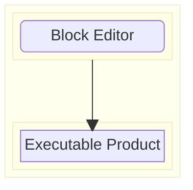

# hacked26

pname is a highly abstracted interface that uses Scratch-like blocks for embedded system development!

With pname, you can go directly from high-level abstractions to a dynamically-linked executable.

# Usage
# Features

