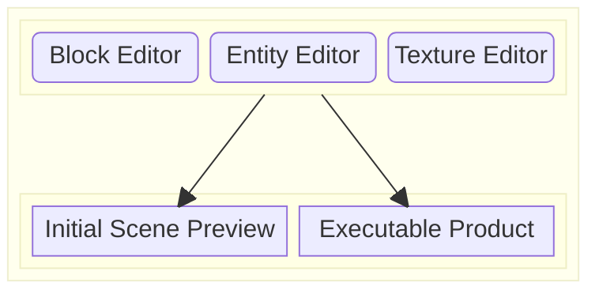

# hacked26

pname is a game engine that uses Scratch-like blocks to design your game!

With pname, you can go directly from high-level abstractions to a dynamically-linked executable.

###### With the same code, preview and deploy your game!

# Usage
# Features

