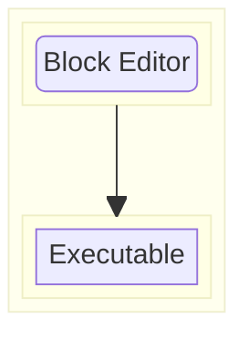

# hacked26

pname is a highly abstracted IDE that uses Scratch-like blocks for embedded system development!

With pname, you can go directly from high-level abstractions to the C level, then compile to a `.uf2` file.

# Usage
# Features

